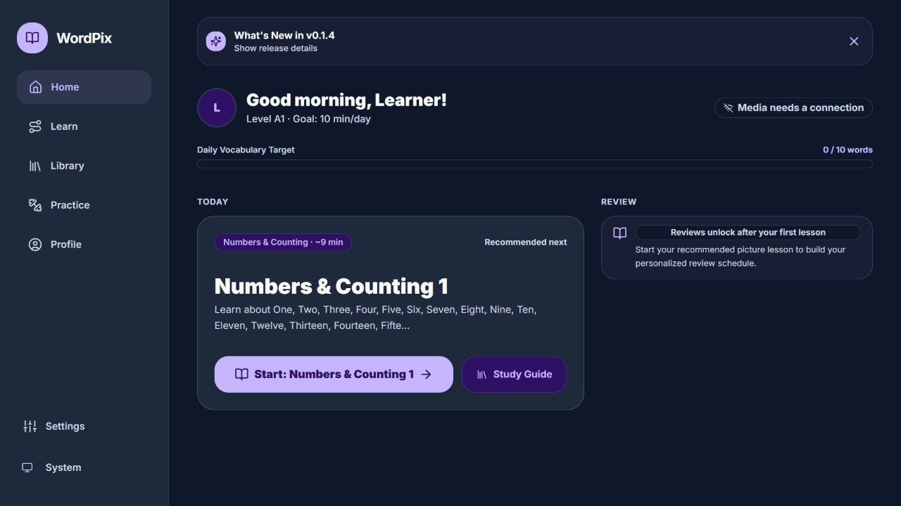
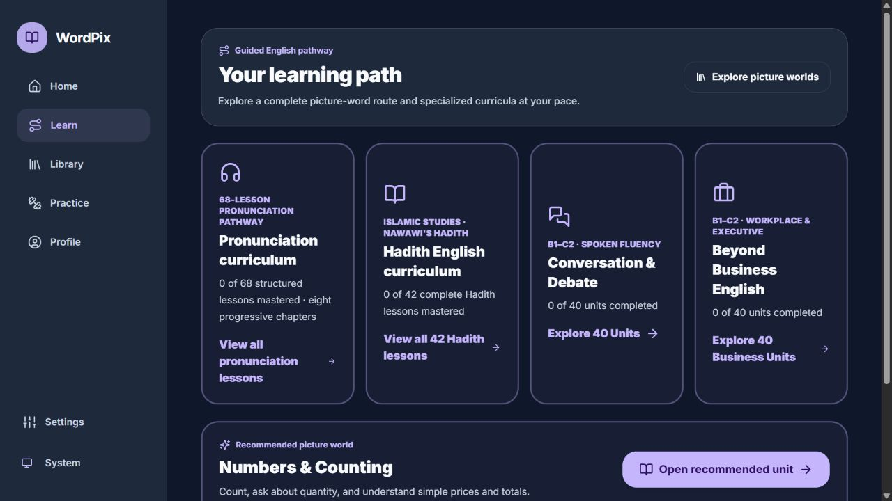
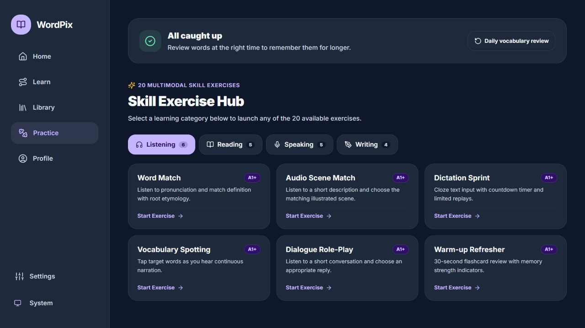
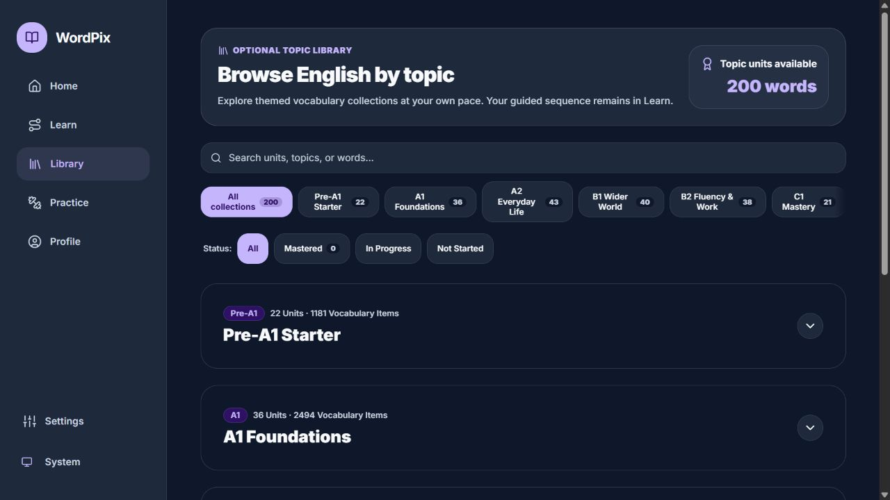
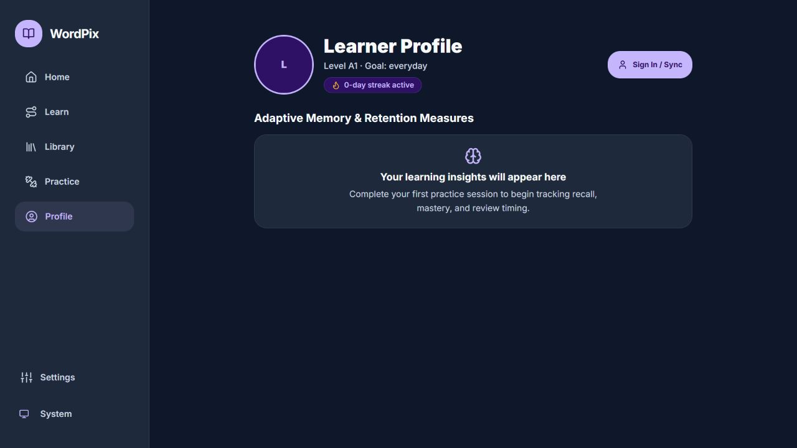
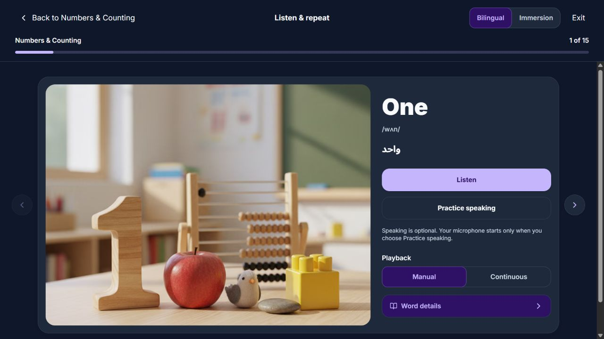
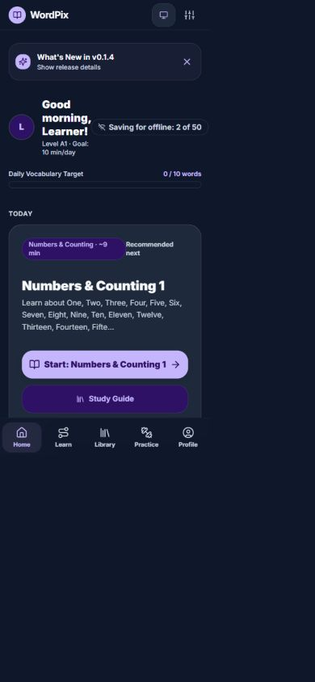
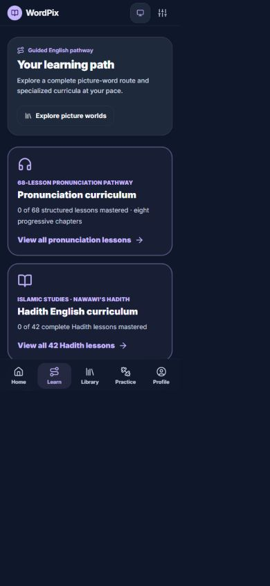
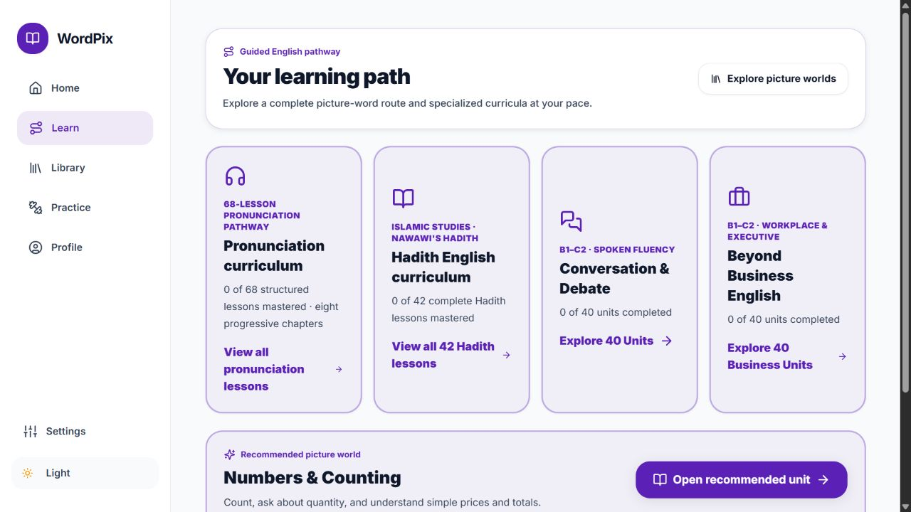

# WordPix Product Experience Audit

**Date:** 27 September 2026  
**Scope:** Home, Learn, Practice, Library, Profile, the Numbers & Counting lesson entry/listen flow, desktop dark/light themes, and 390 px mobile behavior.  
**Target:** Adult English learners (A1–C1), bilingual English/Arabic, WCAG 2.2 AAA ambition.

## Executive verdict

WordPix has a strong product and engineering foundation. The visual language is coherent, the lesson screen is polished, the learning model combines visual support, audio, retrieval, production, and spaced review, and the codebase has unusually strong automated coverage. The app is already more disciplined than most learning products in its semantic tokens, touch targets, focus management, RTL support, and honest handling of speech recognition.

The most important remaining work is not a redesign. It is coherence: align navigation order with the locked product model, make every progress count and content total truthful, reduce competing labels and release/status chrome, and make the core guided path visibly primary. These changes would make the product feel calmer, more trustworthy, and easier for a learner to resume.

This audit does **not** claim WCAG 2.2 AAA conformance. Screenshots, source inspection, and automated tests cannot replace a criterion-by-criterion audit with keyboard, screen reader, zoom/reflow, contrast, motion, and cognitive-accessibility validation.

## Experience scorecard

| Area                     |          Health | Summary                                                                                                                                |
| ------------------------ | --------------: | -------------------------------------------------------------------------------------------------------------------------------------- |
| Core UX                  |          7.5/10 | Clear next lesson and strong lesson screen; several competing status/CTA messages remain.                                              |
| Information architecture |          6.5/10 | Five-tab model is understandable, but tab order conflicts with the locked IA and Learn under-emphasizes the main path.                 |
| Visual design            |            8/10 | Premium, calm, cohesive; hierarchy is weakened by extensive violet tint/borders and similar card treatments.                           |
| Clutter and clarity      |          6.5/10 | Clean component design, but release notes, offline status, repeated labels, and count drift create avoidable noise.                    |
| Responsiveness           |            7/10 | Mobile shell and bottom navigation are good; the Home status badge collides with the greeting at 390 px.                               |
| Robustness               |            9/10 | TypeScript, lint, and 2,458 tests pass; URL/session and copy-derived state need stronger integration tests.                            |
| Accessibility            | 8/10 foundation | Strong tokens, targets, landmarks, focus traps, and RTL; AAA remains unverified and some control semantics/reflow need manual testing. |
| Design system            |            8/10 | Mature color/type/radius/shadow tokens; spacing, motion, density, and card/CTA recipes should be formalized.                           |
| Learning design          |            8/10 | Good dual coding, retrieval, optional speech, and spaced review; cognitive load and progress framing need refinement.                  |

## Captured flow

### Step 1 — Home: needs refinement

The recommended lesson is prominent and actionable. The daily target and review preview support habit formation. However, “10 min/day” and “0/10 words” mix two goal systems, the release-note banner competes with the learning task, and “Media needs a connection” reads like an error before the learner has done anything.

### Step 2 — Learn: structurally sound, hierarchy needs work

Special curricula are clearly separated, but four equally prominent course cards appear before the core picture-word path. “Explore picture worlds,” “picture-word route,” “recommended picture world,” and “learning path” describe the same domain with different mental models. The retired “worlds” terminology should disappear from learner-facing copy.

### Step 3 — Practice: good structure, mixed state message

The page correctly leads with review and then practice by skill. Category counts and short exercise descriptions make selection easy. “All caught up” beside a “Daily vocabulary review” button is ambiguous: either there is nothing to review, or the button should explain that it starts optional practice. The UI reports 20 exercises while the README says 31 drills; one source of truth is needed.

### Step 4 — Library: useful, but contains a trust-breaking count error

Search, CEFR filters, status filters, and collapsed level groups make a large catalogue manageable. The summary says “Topic units available — 200 words,” while the same screen shows 200 collections/units and thousands of vocabulary items. This is a high-priority content-integrity defect.

### Step 5 — Profile: clear but underpowered

The empty state is calm and honest, but the screen is too sparse to explain the value of returning or signing in. Add a short “what will appear here” preview (retention, difficult words, learning time, goal progress) and explain sync/privacy near the sign-in action.

### Step 6 — Listen & repeat lesson: visually strong, progress model inconsistent

This is the strongest screen in the audit. The image, English word, phonetic form, Arabic gloss, listening, optional speaking, playback mode, and details are arranged in a clear learning hierarchy. The critical issue is progress inconsistency: the browser title shows lesson **1/5**, the screen reader route announcement says **step 1 of 6**, and the activity header shows **1 of 15 words**. Words and stages are different measures, but they are not named consistently enough to prevent confusion; the 5-vs-6 stage count is a direct defect.

### Step 7 — Mobile Home: usable, with one visible collision

The primary action, bottom navigation, and card layout reflow well. At 390 px, “Saving for offline: 2 of 50” overlaps the learner greeting. Make this status a full-width row below the greeting, a compact icon with an accessible label, or a non-blocking live-status toast.

### Step 8 — Mobile Learn: readable, but the core path falls below the fold

Cards are comfortable to read and tap. Because specialized curricula come first, a new learner can scroll through multiple optional tracks before reaching the main A1→C1 path. Put “Continue your guided path” first, then offer specialized courses as secondary choices.

### Step 9 — Light theme: attractive but over-tinted

Light mode is clean and high quality. Pale violet fills and violet borders are applied to every course card, making all cards look selected or emphasized. Use neutral card surfaces by default and reserve violet fill/border for selection, recommendation, or primary action. Measure non-text border and focus-indicator contrast against adjacent surfaces before claiming AAA.

## Highest-impact findings

### P0 — Correct truth and navigation before visual polish

1. **Unify lesson stage counts.** Derive the browser title, route announcement, stepper, and progress component from one `LESSON_STEP_COUNT`. Current code contains both 5 and 6.
2. **Fix the Library unit/word label.** Display “200 topic units” (or the real vocabulary-item total), never “200 words.”
3. **Use the locked tab order:** Home → Learn → Practice → Library → Profile. Both desktop and mobile currently place Library before Practice.

### P1 — Make the learning journey calmer and more obvious

4. Put the learner’s next guided-path action at the top of Learn. Keep Pronunciation, Hadith, Conversation, and Business as clearly optional/specialized cards below it.
5. Replace “worlds” terminology with one stable vocabulary: **guided path**, **unit**, **lesson**, **practice**, and **library**.
6. Resolve the 20-vs-31 practice catalogue discrepancy and clarify “All caught up” versus “Daily vocabulary review.”
7. Choose one daily-goal contract. If the goal is time, show minutes and estimate the next lesson; if it is vocabulary, show words. Do not present both as if they are the same target.
8. Fix the 390 px offline-status collision and add a regression screenshot/test for 320, 390, 768, 1024, and 1440 px widths at 100%, 200%, and the app’s 150% text setting.

### P2 — Refine the system and learning experience

9. Demote release notes after first exposure to a small notification in Profile/Settings; Home should prioritize today’s learning.
10. Formalize design-system recipes for page headers, course cards, status cards, primary/secondary CTAs, empty states, and selected filters. Add spacing, density, and motion tokens to the existing color/type/radius/shadow system.
11. Keep violet as the brand/primary-action color. Use green only for verified success, amber for attention/streaks, rose for errors, and teal for informational/offline status. Do not add a rainbow of course colors; distinguish courses primarily with iconography, title, and metadata.
12. Add a useful Profile preview and a clear explanation of what signing in syncs, what remains local, and how learner data is protected.

## Accessibility assessment

### Confirmed strengths

- A skip link and main landmark are exposed in every captured route.
- Primary navigation uses `aria-current="page"` in source.
- Interactive targets are generally at least 44 × 44 px; dedicated tests cover this contract.
- Dialog focus traps, Escape behavior, and focus return are covered by tests.
- Lesson status changes use live regions; Arabic glosses use `lang="ar"` and `dir="rtl"`.
- Motion classes are predominantly guarded with `motion-safe`, and the project exposes reduced-motion/high-contrast/text-scale settings.
- Semantic design tokens define explicit foreground/background pairs for dark, light, and high-contrast modes.

### Risks and verification gaps

- The 390 px Home collision is a visible reflow/legibility risk.
- Mutually exclusive controls such as Bilingual/Immersion and Manual/Continuous appear as checkbox-like controls in the accessibility tree. Prefer a radio group or a segmented control with unambiguous selected-state semantics.
- Several automated axe specs run A/AA/2.2-AA tags, not a complete WCAG 2.2 AAA criterion set. An additional AAA-tagged spec exists outside the configured `e2e` test directory, so it is not part of the normal Playwright run.
- Automated contrast tests validate token pairs, not every final rendered combination, image overlay, disabled state, focus ring, or non-text boundary.
- Sticky headers/bottom navigation need manual Focus Not Obscured testing at 200% and 400% zoom.
- Screen-reader reading order, rotor/landmark quality, speech-output timing, Arabic pronunciation, and error recovery require NVDA/JAWS/VoiceOver sessions.
- Bottom-tab labels are visually small for an adult-learning product. WCAG has no general minimum font size, but 12–14 px is a safer usability target, especially at 125%/150% text settings.

## Learning-methodology assessment

### What is working

- **Dual coding:** image + spoken form + written form + phonetic cue + optional Arabic support.
- **Scaffolding:** bilingual and immersion modes let learners reduce support.
- **Retrieval and feedback:** later recall, context, sentence construction, and quiz stages move beyond passive exposure.
- **Spaced repetition:** review is separated from discovery and uses due-state logic.
- **Productive practice:** optional speaking and sentence-building add output, not just recognition.
- **Learner autonomy:** playback modes, study materials, word details, and non-forced microphone use support different needs.
- **Honest assessment:** speech recognition is used for word recognition rather than fabricated pronunciation percentages.

### Improvements

- Fifteen new words in one listen/repeat batch is heavy for many A1 adults. Start with smaller chunks (for example 5–8), retrieve them, then add the next chunk; preserve the 15-word group as the lesson total.
- Add an explicit lesson objective and success criterion at entry: “By the end, you can understand and use numbers 1–15.”
- Use adaptive scaffolding: show Arabic/phonetic support initially, then fade it after successful retrieval, while keeping a learner-controlled hint.
- Interleave old and new vocabulary inside practice rather than grouping all exposure before retrieval.
- After an error, explain the useful distinction and schedule a near retry plus a delayed retry. Keep feedback brief enough not to interrupt flow.
- End each lesson with transfer: a novel image, short authentic scenario, or simple communicative task—not only another recognition item.
- Make mastery language precise: “seen,” “practised,” “recalled,” and “mastered” should map to explicit rules and never be used interchangeably.

## Robustness and engineering evidence

- `npx tsc --noEmit`: **pass**, zero type errors.
- `npx vitest run`: **pass**, 97 files and 2,458 tests.
- `pnpm run lint`: **pass**, zero ESLint errors.
- Test coverage includes curriculum integrity, asset integrity, modal accessibility, touch targets, responsive contracts, RTL logical properties, audio fallbacks, speech-recognition honesty, offline/sync logic, routing, and learning progression.

The remaining robustness opportunity is integration consistency: derive user-facing counts and labels from shared typed data, add screenshot/reflow tests for the actual Home header, and test URL/title/rendered-screen agreement for non-reconstructable lesson routes. A route that cannot reconstruct an active lesson should redirect to the unit entry or show a clear resume message rather than allowing the URL/title and rendered screen to disagree.

## Recommended implementation order

1. **One-day integrity pass:** tab order, Library count label, lesson stage count, practice catalogue count.
2. **One-week clarity pass:** Learn hierarchy, terminology, Home goal model, review empty-state copy, mobile offline badge.
3. **Design-system pass:** neutral/default card recipe, selected/recommended states, spacing/density/motion tokens, responsive regression matrix.
4. **Learning-design pass:** smaller teaching chunks, adaptive hint fading, interleaving, near/delayed retries, authentic transfer tasks.
5. **Accessibility release audit:** WCAG 2.2 AAA criterion matrix, measured rendered contrast, keyboard-only flows, NVDA/VoiceOver, 200%/400% zoom, 320 px reflow, Arabic/RTL, reduced motion, high contrast, and cognitive-accessibility review.

## Evidence limits

The audit used a fresh local app session, current screenshots, source inspection, and the project’s automated checks. It did not modify application code, learner data, or R2 media mappings. Microphone permission, real audio output quality, screen-reader speech, production Supabase behavior, real offline recovery, and full lesson completion were not exercised. Those areas remain verification work, not confirmed defects or confirmed compliance.
