# WordPix mobile UX review

Reviewed locally on 5 October 2026. The reviewed changes are prepared for publication on the mobile UX review branch; production deployment is separate. Existing editorial/spreadsheet work was preserved. R2 assets, URLs, and content-to-media mappings were not changed.

The strongest existing features are the labelled five-tab navigation, a clear recommended lesson, optional speaking/listening, accessible modal focus management, and real empty states. The main mobile weakness was priority: banners, large summary cards, and optional courses delayed access to the learner's next task.

## Scope and evidence

Screenshots were captured from the local compiled app at 390 × 844 CSS pixels. Browser checks also cover 320px, Arabic RTL, dark mode, reduced motion, and the app's 150% text setting. Screenshots below are from this review, not earlier audits. Each numbered screenshot identifies the inspected section.

All five main tabs, Settings, onboarding/setup, unit entry, vocabulary study, and the four specialist curriculum indexes were inspected. Exercise, review, and specialist lesson coverage is representative; this is not an exhaustive audit of every exercise, lesson stage, authentication state, or network condition. Automated checks do not establish WCAG AAA conformance.

## Section-by-section findings

| Step / section                           | Finding and learner impact                                                                                                                                                                                                                                                    | Local improvement                                                                                                                                                                                                                                          | Further recommendation                                                                                                                                                                                                                                                |
| ---------------------------------------- | ----------------------------------------------------------------------------------------------------------------------------------------------------------------------------------------------------------------------------------------------------------------------------- | ---------------------------------------------------------------------------------------------------------------------------------------------------------------------------------------------------------------------------------------------------------- | --------------------------------------------------------------------------------------------------------------------------------------------------------------------------------------------------------------------------------------------------------------------- |
| 1. Home                                  | Release notes preceded the greeting and lesson. The unit/time badge squeezed the recommendation label. The lesson description ends in a truncated word list.                                                                                                                  | Moved release notes below learning/review; metadata wraps without squeezing.                                                                                                                                                                               | Replace the generated word list with a short learning outcome and an accurate session preview. Reconcile the fixed ten-word target with the learner's selected time goal.                                                                                             |
| 2. Learn                                 | Four large specialist cards appeared before the full general English path. Learners could mistake optional courses for the main sequence.                                                                                                                                     | Moved the complete learning-path control and its contents ahead of specialist courses; preserved curriculum order and unit IDs.                                                                                                                            | Give optional courses a visible section heading; use shorter mobile cards with a clear audience/level and time commitment.                                                                                                                                            |
| 3. Practice                              | Speaking and Writing were hidden in horizontal scrolling. “Skill Exercise Hub” and descriptions such as “root etymology” and “cloze text input” were unnecessarily technical. The skill section referenced a missing heading ID.                                              | Skill choices wrap into a responsive grid. Added “Practice by skill,” plain descriptions, English/Arabic exercise-card translations, and the missing labelled heading. Filter chips now support arrows, Home/End, and one Tab stop per radio group.        | Distinguish first-use “Complete a lesson to build reviews” from returning-user “All caught up.” Show timer/microphone requirements only when relevant to the selected drill.                                                                                          |
| 4. Library                               | A large unit-count card and eleven filter chips occupied almost the entire initial viewport; results started below the fold.                                                                                                                                                  | Search comes first; optional level/progress filters are in a native disclosure. Hid the large summary on phones, enlarged search text, translated Clear search, and added a live result count.                                                             | Show selected filter names outside the disclosure when collapsed. Clarify that word matches return topic units, rather than a dictionary definition. Consider a direct reference-result view as a separate future feature.                                            |
| 5. Profile                               | A large avatar and “0-day streak active” dominated the page. “Goal: everyday” exposed an internal value. “Adaptive Memory & Retention Measures” was technical. The empty statistics state had no next action. A signed-in mobile sign-out control lacked a useful label.      | More compact identity row; honest first-streak copy; translated goal names; “Your learning progress”; a Practice action in the empty state; visible and accessible Sign out.                                                                               | Explain each metric in everyday language, distinguish “not measured” from a measured zero, and make account/sync status explicit.                                                                                                                                     |
| 6. Settings                              | Multiple controls were named only “Enabled”/“Disabled.” Tight horizontal rows made longer labels and enlarged text awkward. AAA terminology and “Bidi numerals” were unsuitable learner-facing headings. Level choices did not expose selected state.                         | Added setting-and-state accessible names; rows wrap; plain section headings; target-level buttons expose their pressed state.                                                                                                                              | Group settings around learner needs, add a section index, and separate offline/storage/reset actions from everyday preferences. Support the locked A1–C2 model throughout onboarding, persistence, and exercise availability; current preferences only support A1–B1. |
| 7. Unit entry                            | The title/header, “Select a Word Group,” introductory text, outcome card, and progress summary repeat orientation before the first group. “WordPix Immersion” does not explain the task.                                                                                      | Kept the working unit/group flow and data intact.                                                                                                                                                                                                          | Condense orientation to one outcome and one next action; call groups “Lessons” if that matches their actual purpose. Keep Test out secondary and explain its effect before starting.                                                                                  |
| 8. Vocabulary study                      | The active activity title is clipped in the mobile header. Six study tabs use generic labels that can be confused with the five global tabs. Some definitions use irrelevant dictionary senses: e.g. “Two” is described as a playing card in a basic-numbers lesson.          | Preserved study navigation, authored content, and assets.                                                                                                                                                                                                  | Make the course context and active activity visible; distinguish study navigation from app navigation. Review contextual definitions before learner release. Use progressive detail within word cards while keeping Listen and status controls directly available.    |
| 9. Pronunciation                         | Three vertically stacked statistic cards pushed the Continue action and search far down the phone screen. The introduction uses pedagogical terminology. A 320px follow-up found nested horizontal overflow from lesson cards, hidden by the outer page fitting its viewport. | Shared curriculum metrics now use an adaptive compact grid. Lesson grids have an explicit shrinkable column; cards stack their media/text on phones and wrap titles, phonetic badges, and contrast words. Decorative image motion respects reduced motion. | Use a short outcome (“Hear sound differences and practise clear speech”) and disclose the teaching method as optional detail. Keep the current chapter and next lesson more prominent than global counts.                                                             |
| 10. Hadith                               | The same stacked-metric pattern delayed entry to the next lesson. “One complete source block” and “retrieval practice” are technical.                                                                                                                                         | Benefits from the compact shared curriculum summary.                                                                                                                                                                                                       | Lead with the lesson's reading/listening task and approximate duration. Retain the complete source, references, and clear separation between English practice and religious interpretation.                                                                           |
| 11. Conversation                         | Four full-width metric cards came before Resume. “Back to Explore” named a retired navigation destination. Search used small text and a generic textbox.                                                                                                                      | Metrics use two columns on phones; back copy points to the learning path; search uses search semantics and 16px base text.                                                                                                                                 | For a new learner, say “Start unit 1” rather than “Resume”; explain the B1–C2 audience without implying a measured proficiency. Keep detailed unit topics readable.                                                                                                   |
| 12. Business                             | Three stacked summary cards, a clipped next-lesson title, and a long credentials section preceded topic discovery. “Tier Certifications” can imply an externally recognized credential.                                                                                       | Compact progress summaries, a full-width wrapping next-lesson row, and readable lesson-title text.                                                                                                                                                         | Move milestone detail below unit discovery or into a disclosure. Use “Course milestones” and explain that completion badges are app achievements unless accreditation is substantiated.                                                                               |
| 13. Welcome                              | The laptop photograph was described as a Bedroom lesson scene and captioned with a Bedroom word count. “Without translation” conflicted with bilingual scaffolding. “Visual English Learning Engine” described implementation.                                                | Accurate photo alternative text/caption; removed the misleading scene/count association; simpler copy describing picture-based learning. The image itself was not changed.                                                                                 | Prefer an actual in-app preview in a later, separately authorized asset task. Add an easy interface-language choice before setup and explain guest progress saving.                                                                                                   |
| 14. Setup / placement                    | Children’s English remained an offered goal despite the locked adult focus. Goal selection was conveyed visually without pressed state. Setup offers only A1–B1.                                                                                                              | Removed the child goal from new setup; exposed goal selection to assistive technology and added visible focus styling. Existing stored preferences remain readable.                                                                                        | Extend the full CEFR model through its data types and placement rules, not just extra buttons. Describe placement as a starting suggestion, not a certified level assessment.                                                                                         |
| 15. Lesson exercises and completion      | Existing flows have dedicated instructions, progression, and feedback; they need checks for long prompts, retries, microphone denial, paused timers, and completion recovery on real phones.                                                                                  | Existing flow behavior was preserved; related browser tests cover vocabulary study, keyboard feedback, pronunciation, and Hadith entry.                                                                                                                    | Audit one complete listening, reading, speaking, and writing session in both languages, including error states. Avoid pressure from automatic advancement; retain learner control and reduced-motion support.                                                         |
| 16. Review and empty states              | Review is correctly reached through Practice. First-use wording can still imply that a personalized schedule already exists.                                                                                                                                                  | Preserved “Reviews due today” as the lead Practice section and kept review out of top-level navigation.                                                                                                                                                    | Use distinct states for no history, nothing due, due today, overdue, and unavailable data. Explain when the next review is due and provide one useful next action.                                                                                                    |
| 17. Global navigation / responsive shell | Five destinations are visible and have accessible names. Labels were only 11px and width caps limited flexibility. Mobile utility labels were hardcoded in English.                                                                                                           | 12px rem-based tab labels with wrapping, flexible widths and existing 56px targets; translated mobile header/home/settings labels.                                                                                                                         | Verify safe-area insets and keyboard appearance on physical iOS/Android devices, including 200% browser text resizing and long Arabic labels. Preserve the five-tab IA.                                                                                               |

## Accessibility findings and limits

The local fixes address accessible names, selected state, keyboard radio behavior, heading relationships, visible choices, reflow, and touch-target sizing. Existing semantic colour tokens were retained. No claim of full AAA conformance is made.

The minimum required follow-up audit should measure normal-text 7:1 and large-text 4.5:1 contrast for every state; verify 44 × 44px targets; check focus size/contrast and that sticky UI never obscures focus; test 200% text/320px reflow; and perform VoiceOver/TalkBack walkthroughs. WCAG 2.4.12 is Focus Not Obscured (Enhanced); focus size/contrast is 2.4.13 Focus Appearance.

Screenshots cannot establish screen-reader announcement quality, real-device keyboard behavior, audio accuracy, or network/sync integrity. No R2 write operation was performed. Live media loading was observed only as a read operation; media safety was maintained by leaving references and mappings unchanged.

## Prioritized next work

1. **High:** complete the A1–C2 preference/placement model; review contextual dictionary senses; verify enlarged-text and screen-reader critical paths on physical phones.
2. **High:** simplify unit/study orientation and distinguish local study navigation from the app's main tabs; audit complete exercise/retry/completion journeys.
3. **Medium:** compact optional course cards; move Business milestones below course discovery; clarify first-use review and resume copy.
4. **Medium:** improve search-result meaning and show active filter names; use learning outcomes instead of truncated generated word lists.
5. **Medium:** simplify remaining specialist copy and clarify app achievements versus externally recognized credentials.

## Evidence gallery

The baseline images show each reviewed section before its local changes. “After” images show the updated main sections. All files are local.

### 1. Home

Before: 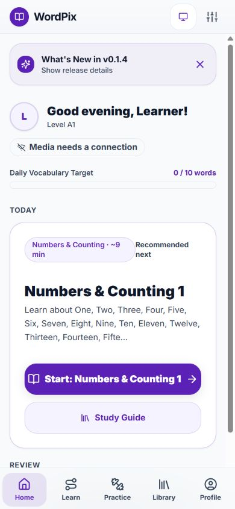

After: 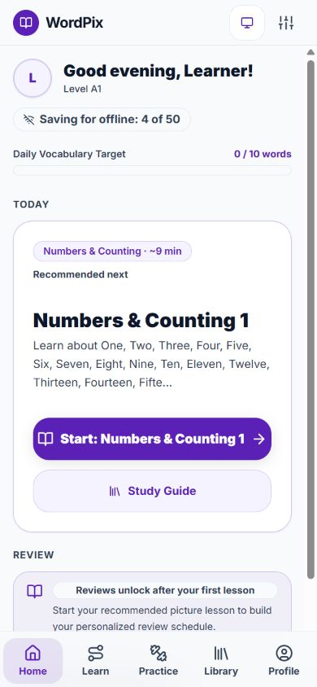

### 2. Learn

Before: 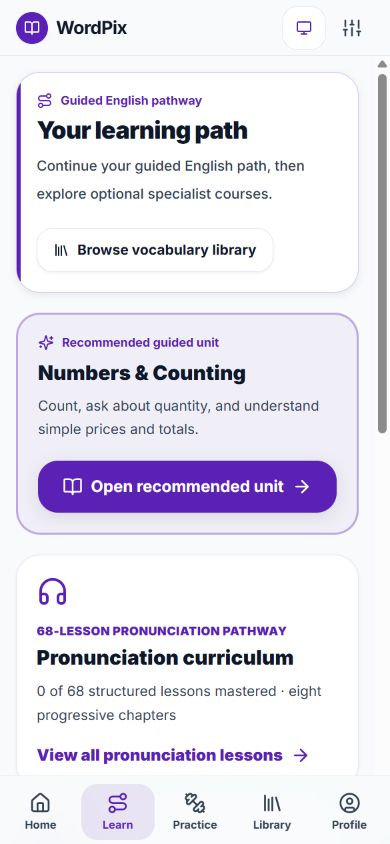

After: 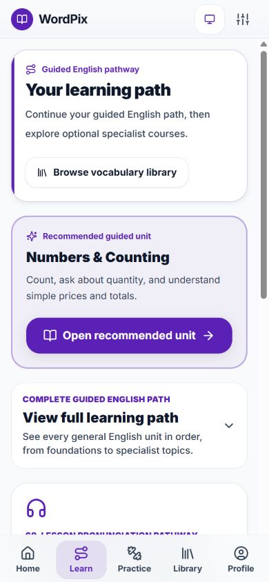

### 3. Practice

Before: 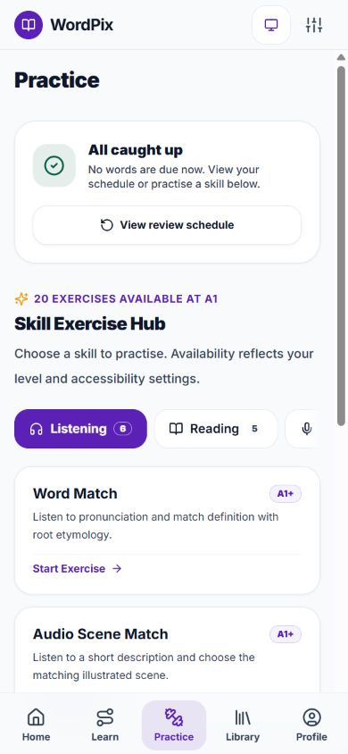

After: 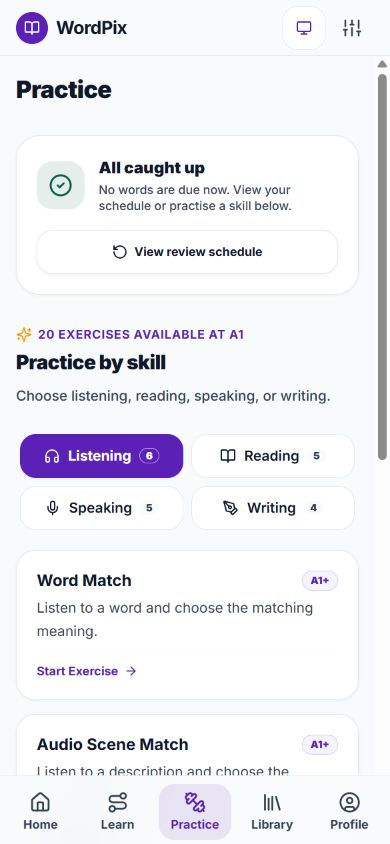

### 4. Library

Before: 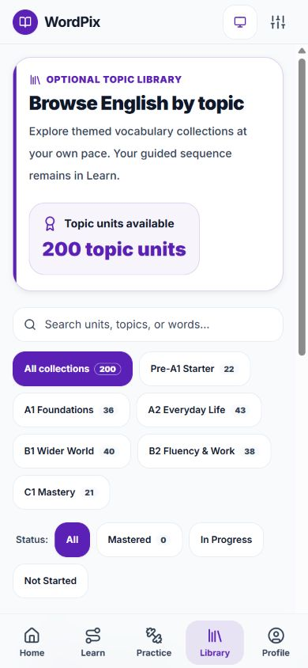

After: 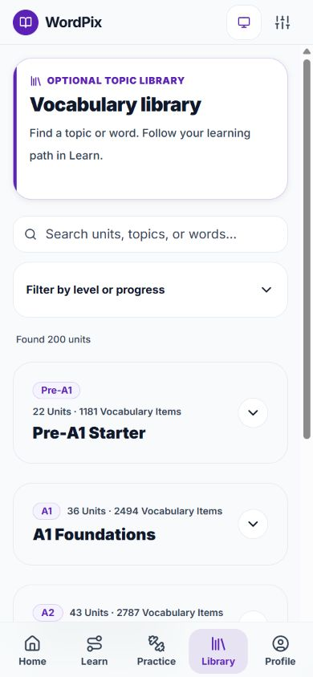

### 5. Profile

Before: 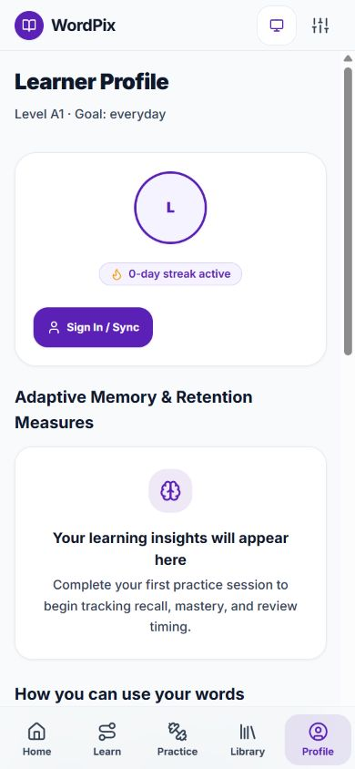

After: 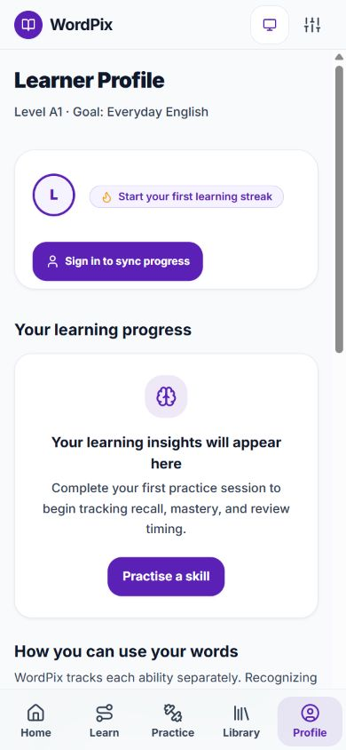

### 6–8. Settings, unit entry, and study

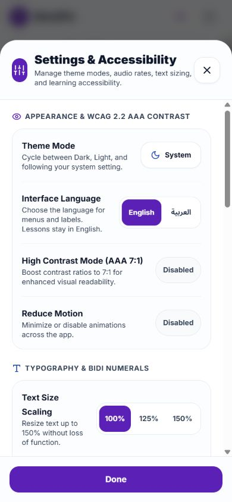

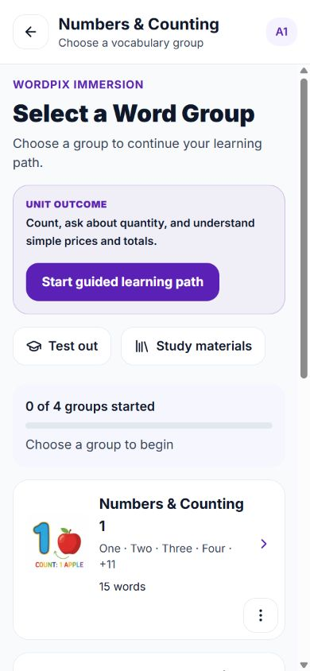

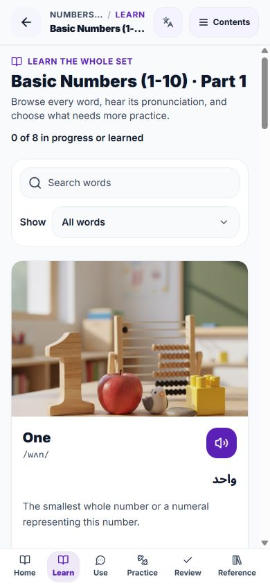

### 9–12. Specialist curricula

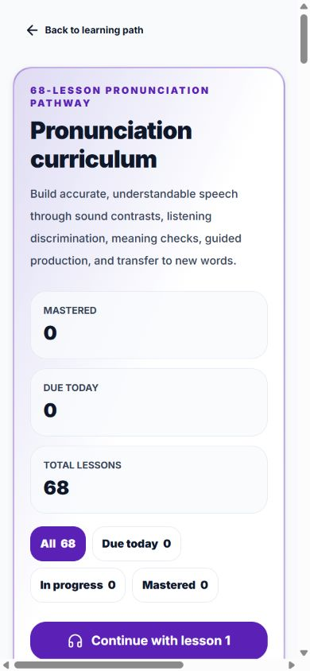

After at 320px: 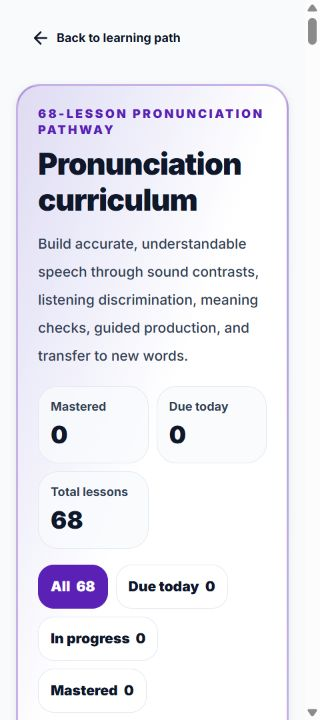

Wrapped lesson cards at 320px: 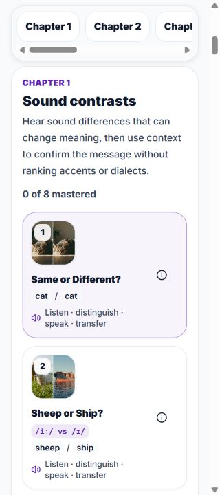

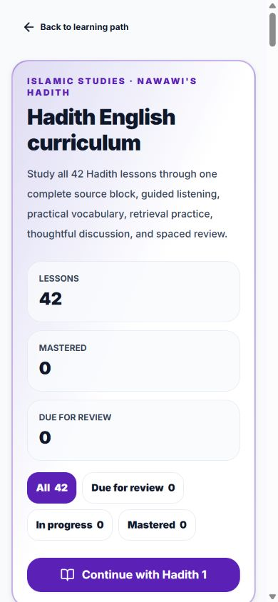

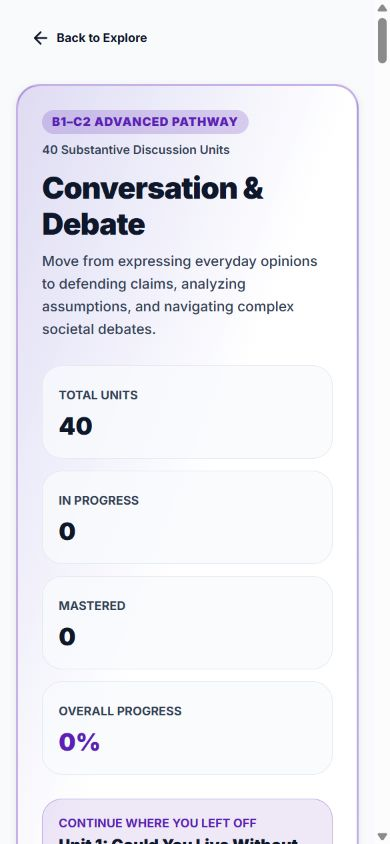

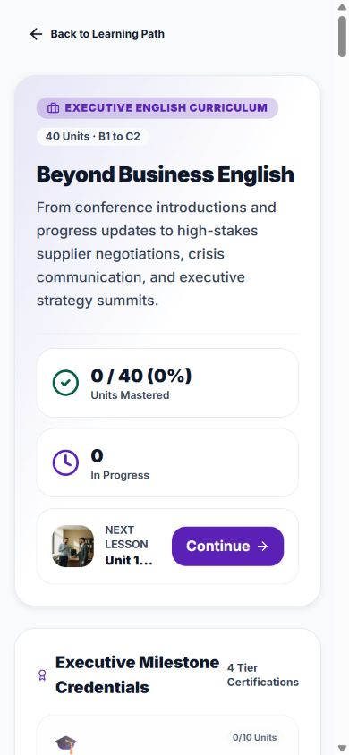

### 13–14. Welcome and setup

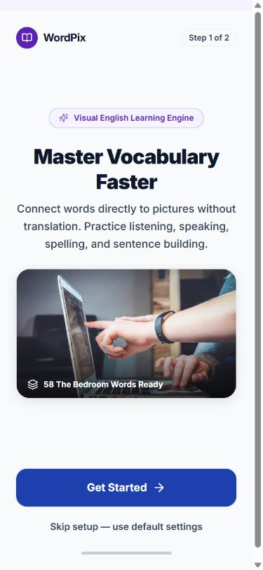

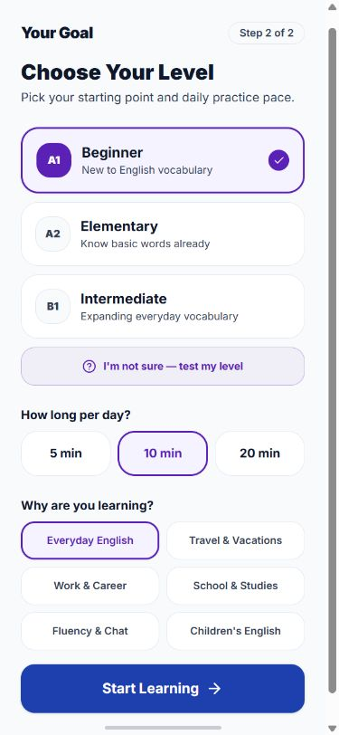

### 15–16. Representative listening exercise and empty review schedule

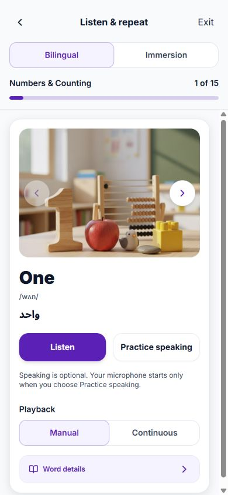

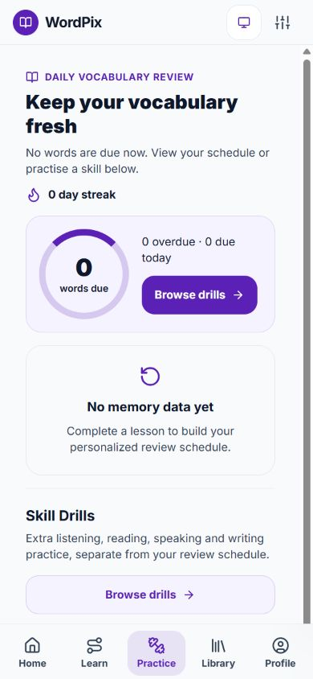

## References

The review applies the project's locked product decisions and guidance alongside [W3C's WCAG 2.2 Understanding documents](https://www.w3.org/WAI/WCAG22/Understanding/), [NN/g's mobile navigation research](https://www.nngroup.com/articles/mobile-navigation-patterns/), and [NN/g's recognition versus recall guidance](https://www.nngroup.com/articles/recognition-and-recall/). These support keeping frequent navigation visible, making choices discoverable, and reducing unnecessary memory load. They do not prove the app conforms to WCAG.

## Verification

- `npx tsc --noEmit`: passed, zero type errors.
- `npx vitest run`: passed, 116 files and 2,630 tests.
- `pnpm run lint`: passed.
- Production frontend build: passed using `pnpm exec vite build --logLevel warn`.
- Mobile Playwright: 24 tests passed across accessibility, smoke, RTL/dark mode, curriculum discovery, and the new mobile-usability suite. Includes 320px containment, 150% app text, labelled 44px controls, keyboard radio navigation, translated Arabic cards, Library search/filter states, and enhanced text contrast on the five main tabs.
- Scoped `git diff --check`: passed.

The CEFR recommendation follows the [Council of Europe's six reference levels, A1–C2](https://www.coe.int/en/web/common-european-framework-reference-languages/level-descriptions). Physical-device screen-reader checks and a complete criterion-by-criterion AAA audit remain follow-up work.
